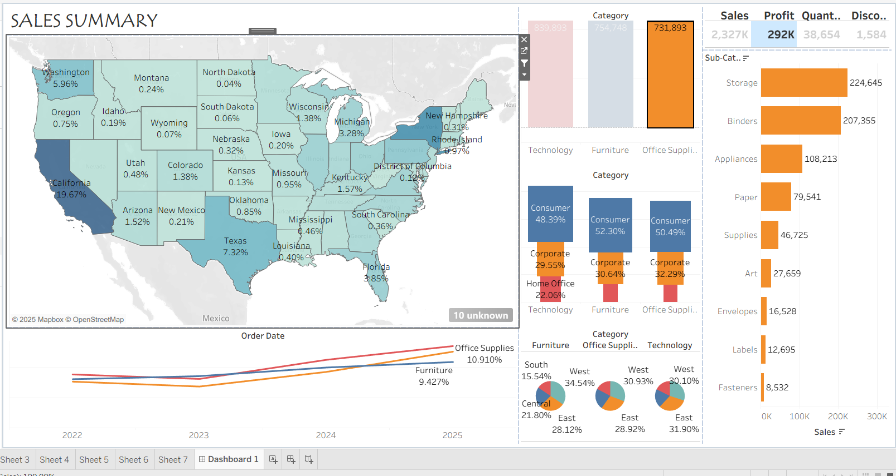
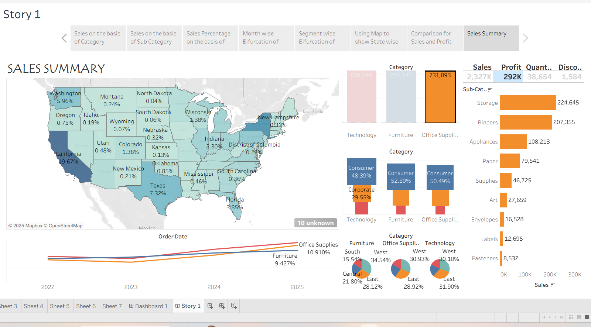

# 📊 Tableau Sales Story Dashboard

This project presents an interactive **Sales Performance Dashboard** created using Tableau and based on the **Superstore Dataset**. It explores patterns in sales, profit, discount, category performance, and customer segmentation across the U.S.

> ⚡️ This is not just a data visualization project — it simulates a business case for analyzing and improving regional sales performance using data insights.

---
## 🛠️ Tools Used

- **Tableau Public / Desktop** – Data visualization & dashboard creation  
- **Excel** – Data preparation  
- **GitHub** – Version control & showcasing the project

---

## 📌 Business Objective

To help the Superstore identify:
- Top and bottom performing **categories & regions**
- High revenue vs low profit segments
- Opportunities for **expansion and optimization**

---

## 📊 Key Visualizations

### 1️⃣ **Sales Dashboard Overview**


- A holistic summary of sales performance: category-wise, state-wise, and segment-wise.
- KPIs like Total Sales, Total Profit, and Average Discount shown with filters.

---

### 2️⃣ **State-wise Sales Performance**


- Interactive U.S. map to explore regional performance.
- Clear sales percentage per state.

---

### 3️⃣ **Category & Subcategory Analysis**
- Visuals: `Sheet1.png`, `Sheet2.png`, `Sheet3.png`
- Shows which products are driving sales vs generating losses.

### 4️⃣ **Year & Segment Trends**
- Visuals: `Sheet4.png`, `Sheet5.png`
- Tracks growth across time and customer segments (Consumer, Corporate, Home Office).

### 5️⃣ **Profitability Distribution**
- Visuals: `Sheet6.png`, `Sheet7.png`
- Spotlights negative profits and areas for optimization.

---

## 🎯 Key Insights

- 📍 **California** drives highest sales (~20%)
- 📉 Some states show high sales but negative profits → margin issues
- 📦 **Office Supplies** is the most popular category but not always profitable
- 🧑‍💼 **Consumer segment** contributes the most sales across all regions

---

## 🚀 How to View Locally

1. Clone or download this repository:
   ```bash
   git clone https://github.com/Aniket-Roy-AR/tableau-sales-dashboard.git

2. Open Tableau_Dashboard.twbx using Tableau Public/Desktop

3. Explore the story layout and dashboards interactively

## 📚 Data Source

- Dataset: Super_store_DataSet.xlsx

- Fields: Order ID, Order Date, Ship Date, Segment, Category, Sub-Category, Sales, Profit, Discount, Region, and State.

## 💼 Business Value
This dashboard can help:

- Regional sales managers spot low-profit zones

- Marketing teams decide where to boost offers

- Product heads choose categories to promote or drop
